# Explainable and Leakage-Aware Machine Learning for Panic Disorder Detection

**A robust evaluation of psychological, behavioral, and clinical predictors**

> **Status (October 2026).** Both experiments have been run end-to-end, each with 50-trial Optuna tuning per model: **Experiment 1** (baseline, no resampling) and **Experiment 2** (SMOTENC). All reported numbers come from saved artifacts, and every test metric was re-verified by reloading the saved models. A FastAPI service serving the selected model runs locally and has been verified end-to-end. This is a research/portfolio project and **not a clinically validated diagnostic tool**.

---

## Table of contents

1. [Overview](#overview)
2. [Key findings](#key-findings)
3. [Research question and objectives](#research-question)
4. [Implementation status](#implementation-status)
5. [Project pipeline](#project-pipeline)
6. [Dataset](#dataset)
7. [Exploratory data analysis](#exploratory-data-analysis)
8. [Data leakage and synthetic-rule audit](#data-leakage-and-synthetic-rule-audit)
9. [Statistical analysis](#statistical-analysis)
10. [Data splitting](#data-splitting)
11. [Data preprocessing](#data-preprocessing)
12. [Feature engineering](#feature-engineering)
13. [Experimental design](#experimental-design)
14. [Cross-validation and hyperparameter optimization](#cross-validation-and-hyperparameter-optimization)
15. [Models](#models)
16. [Evaluation metrics](#evaluation-metrics)
17. [Results](#results)
18. [Calibration analysis](#calibration-analysis)
19. [SHAP explainability](#shap-explainability)
20. [Linking statistical analysis, leakage audit and SHAP](#linking-statistical-analysis-leakage-audit-and-shap)
21. [Model selection](#model-selection)
22. [Project architecture](#project-architecture)
23. [Installation](#installation), [Reproducibility](#reproducibility) and [Usage](#usage)
24. [FastAPI deployment](#fastapi-deployment)
25. [Limitations](#limitations)
26. [Ethical / clinical disclaimer](#ethical--clinical-disclaimer)
27. [Future work](#future-work)
28. [Author](#author)

---

## Overview

Panic disorder is a common anxiety disorder. Its symptoms (chest pain, dizziness, shortness of breath) overlap with cardiac and respiratory conditions, which makes it hard to recognize. A screening model that combines demographic, psychological, behavioral and clinical information is an appealing idea. It is also a setting where ML can easily mislead:

- **The outcome is rare.** About 4.3% of records are positive. A model that predicts "no panic disorder" for everyone is 95.7% accurate and clinically useless.
- **Very high scores call for scrutiny, not celebration.** Near-perfect discrimination on tabular health data usually points to leakage, a synthetic generation process or a target-defining variable, not to clinical insight.
- **Probabilities matter, not just labels.** A risk score used for triage has to be calibrated, not just well ranked.
- **Resampling is not free.** Oversampling methods such as SMOTENC change the class prior the model learns, and they can introduce artefacts of their own.
- **Explanations must be read in context.** If the features a model relies on are the same ones that look suspicious in the data audit, that is a finding about the dataset, not the disease.

The project is therefore built around **leakage-aware evaluation** rather than maximum accuracy. It includes a dataset audit before modelling, a split-first and fit-on-train-only pipeline, resampling confined to training folds, imbalance-appropriate metrics with bootstrap confidence intervals, calibration analysis, SHAP explanations, and an explicit link between all of them.

---

## Key findings

1. **The dataset shows strong signs of synthetic, rule-based labelling.** All 5,126 positive cases have `Lifestyle Factors = Sleep quality`, and the other two categories have exactly 0% positives. Inside that group, the positive rate climbs steeply with the number of "risk indicators" present. Predictors are mutually independent (max inter-predictor Cramér's V = 0.009).
2. **Gradient boosting fits this structure almost perfectly.** The best test PR-AUC is **0.972** (Exp. 1 LightGBM). Logistic Regression, an additive model, stays at 0.668, which is consistent with a label that depends on interactions.
3. **SMOTENC did not improve ranking, and it damaged calibration.** It lowered PR-AUC for all four models, consistently across CV, validation and test. It raised recall at 0.5 (for example LightGBM 0.921 → 0.997) at the cost of precision (0.883 → 0.823), and it increased Brier scores 1.3–2.8×. For the tree models, simply **lowering the Exp. 1 threshold** reproduces the Exp. 2 recall with the same or better precision.
4. **SMOTENC introduced a measurable artefact.** Interpolated synthetic positives have non-integer ages, which no real record has. In Exp. 2, XGBoost places 51% of its Age split thresholds at fractional values (0% in Exp. 1), and Age rises from SHAP rank 18 to rank 10–13.
5. **SHAP rankings mirror the audit almost exactly.** The model is driven by the same variables, at the same risk levels, that the statistical and leakage audit flagged. That makes the pipeline credible, and it makes any clinical claim untenable.
6. **Selected model: Experiment 1 LightGBM.** It has the highest validation PR-AUC in Exp. 1 and the best test PR-AUC, recall, F1 and Brier of all eight models. XGBoost is statistically indistinguishable from it.

---

## Research question

> **Can machine-learning models reliably predict panic-disorder diagnosis from demographic, psychological, behavioral, and clinical characteristics, and to what extent does that performance reflect the structure of the dataset rather than generalizable signal?**

### Objectives

| # | Objective | Status |
|---|---|---|
| 1 | Investigate and understand the dataset | ✅ [`notebooks/01_eda.ipynb`](notebooks/01_eda.ipynb) |
| 2 | Identify possible data leakage or synthetic-rule artifacts | ✅ [`src/analysis/leakage_audit.py`](src/analysis/leakage_audit.py) plus extended analysis below |
| 3 | Statistically test predictor–diagnosis associations | ✅ [`src/analysis/statistical_tests.py`](src/analysis/statistical_tests.py) |
| 4 | Build leakage-aware preprocessing and feature-engineering pipelines | ✅ |
| 5 | Compare several ML algorithms | ✅ LR, RF, XGBoost, LightGBM |
| 6 | Investigate the effect of SMOTENC on class imbalance | ✅ Experiment 2 |
| 7 | Optimize models with cross-validation and Optuna | ✅ 50 trials × 5 folds per model and experiment |
| 8 | Evaluate with imbalance-appropriate metrics | ✅ PR-AUC, recall, precision, F1, specificity, Brier, bootstrap CIs |
| 9 | Explain models with SHAP | ✅ TreeSHAP on the selected model per experiment |
| 10 | Assess probability calibration | ✅ Reliability curves, Brier, ECE (no recalibration yet) |
| 11 | Identify the strongest model and its limitations | ✅ |
| 12 | Prepare the model for deployment | ✅ Local FastAPI service (verified); Streamlit client available |

---

## Implementation status

| Component | State | Evidence |
|---|---|---|
| Data ingestion and merge of the two raw files | ✅ Implemented and run | `data/raw/panic_disorder_dataset.csv` (120,000 rows) |
| EDA and figures | ✅ Implemented and run | `notebooks/reports/figures/` |
| Leakage / synthetic-rule audit; χ², Cramér's V, point-biserial | ✅ Implemented and run | notebook outputs, recomputed for this README |
| Stratified train/val/test split with train-only imputation | ✅ Implemented and run | `src/pipelines/data_pipeline.py`, `data/processed/*.parquet` |
| One-hot encoding fitted per fold or on train | ✅ Implemented and run | `src/models/evaluate_model.py::prepare_features` |
| **Experiment 1**: Optuna → 5-fold CV → refit → val/test | ✅ Implemented and run | `artifacts/experiment_1/` |
| **Experiment 2**: SMOTENC inside training folds, same protocol | ✅ Implemented and run | `artifacts/experiment_2/` |
| Optuna (TPE, MedianPruner, CV PR-AUC objective) | ✅ Enabled, 50 trials | `optuna` block per model in `model_comparison.json` |
| Test evaluation, bootstrap 95% CIs, confusion matrices | ✅ Implemented and run | `artifacts/experiment_*/metrics/` |
| Calibration curves and Brier score | ✅ Implemented and run | `metrics/calibration_curves/` |
| SHAP (TreeExplainer / LinearExplainer) | ✅ Implemented and run (selected model only) | `metrics/shap/` |
| FastAPI inference service (serves Exp. 1 best model) | ✅ Implemented and verified locally | see [FastAPI deployment](#fastapi-deployment) |
| Streamlit client | ⚠️ Implemented, calls the API; not re-tested in this review | `streamlit/app.py` |
| Probability recalibration, threshold optimization | ❌ Planned | — |
| Deep-learning models (MLP, TabNet, FT-Transformer) | ❌ Planned: hyperparameters exist in `config.yaml`, no model code | `dl_models` in config |

---

## Project pipeline

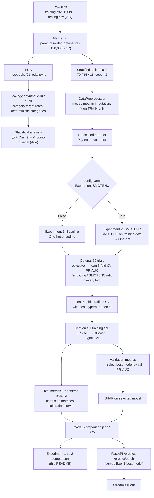

> The audit and statistical analysis (C–E) are **exploratory and use the full 120k dataset**. They informed interpretation but were **not** used to select or drop features. All 15 predictors are modelled.

---

## Dataset

| Property | Value (verified from `data/raw/`) |
|---|---|
| Source | Two CSV files, `panic_disorder_dataset_training.csv` (100,000 rows) and `panic_disorder_dataset_testing.csv` (20,000 rows). The repository does not document their provenance; the file names match a publicly available Kaggle dataset. **A citation should be added.** |
| Modelling dataset | The two files are concatenated in `notebooks/01_eda.ipynb` into `panic_disorder_dataset.csv`: **120,000 rows × 17 columns** |
| Target | `Panic Disorder Diagnosis` (0 = no, 1 = yes) |
| Identifier | `Participant ID`, **dropped before modelling**. It is not a unique key: the testing file reuses IDs 1–20,000. |
| Predictors | 15: 1 numerical (`Age`) and 14 categorical |
| Positive class | **5,126 / 120,000 = 4.27%** (training file 4.29%, testing file 4.21%) |
| Missing values | `Substance Use` 33.3%, `Medical History` 25.1%, `Psychiatric History` 24.9%; all other columns complete |
| Duplicates | 0 full-row duplicates including ID; 50 rows duplicate another row on all predictors and the target (ID excluded) |

### Features

| Feature | Type | Levels (from `categorical_values.yaml`) | Missing |
|---|---|---|---:|
| Age | numerical (integer) | 18–65, mean 41.5, sd 13.8 | 0% |
| Gender | binary | Female, Male | 0% |
| Family History | binary | No, Yes | 0% |
| Personal History | binary | No, Yes | 0% |
| Current Stressors | ordinal-like | Low, Moderate, High | 0% |
| Symptoms | nominal | Chest pain, Dizziness, Fear of losing control, Panic attacks, Shortness of breath | 0% |
| Severity | ordinal-like | Mild, Moderate, Severe | 0% |
| Impact on Life | ordinal-like | Mild, Moderate, Significant | 0% |
| Demographics | binary | Rural, Urban | 0% |
| Medical History | nominal | Asthma, Diabetes, Heart disease | 25.1% |
| Psychiatric History | nominal | Anxiety disorder, Bipolar disorder, Depressive disorder | 24.9% |
| Substance Use | nominal | Alcohol, Drugs | 33.3% |
| Coping Mechanisms | nominal | Exercise, Meditation, Seeking therapy, Socializing | 0% |
| Social Support | ordinal-like | Low, Moderate, High | 0% |
| Lifestyle Factors | nominal | Diet, Exercise, Sleep quality | 0% |

All categorical variables are currently treated as **nominal** and one-hot encoded, including the ordinal-like ones.

---

## Exploratory data analysis

EDA lives in [`notebooks/01_eda.ipynb`](notebooks/01_eda.ipynb), with plotting helpers in [`src/visualization/eda_plots.py`](src/visualization/eda_plots.py). Figures are saved to [`notebooks/reports/figures/`](notebooks/reports/figures/).

| Target distribution | Missing-value pattern |
|---|---|
|  | 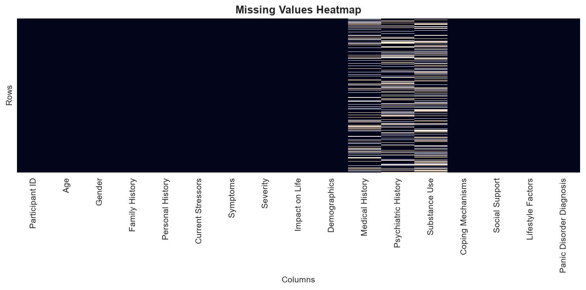 |

| Age by diagnosis | Lifestyle Factors by diagnosis |
|---|---|
| 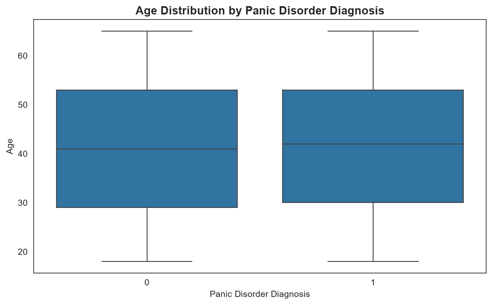 | 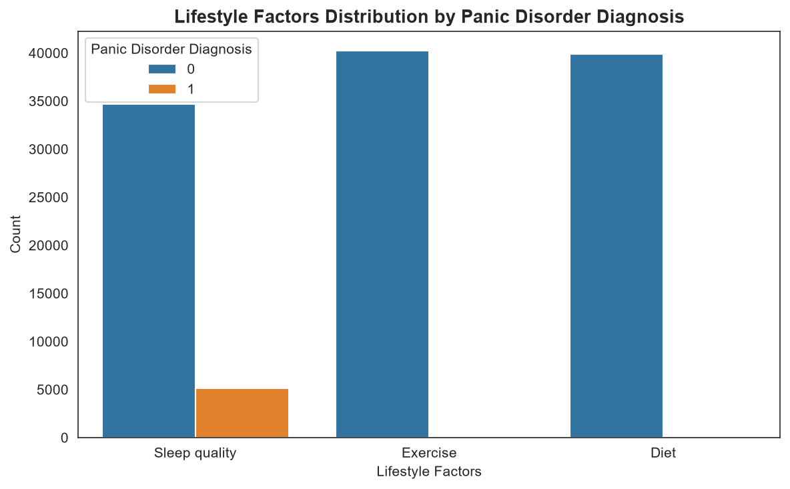 |

<details>
<summary>More EDA figures (categorical distributions, target rate per feature)</summary>

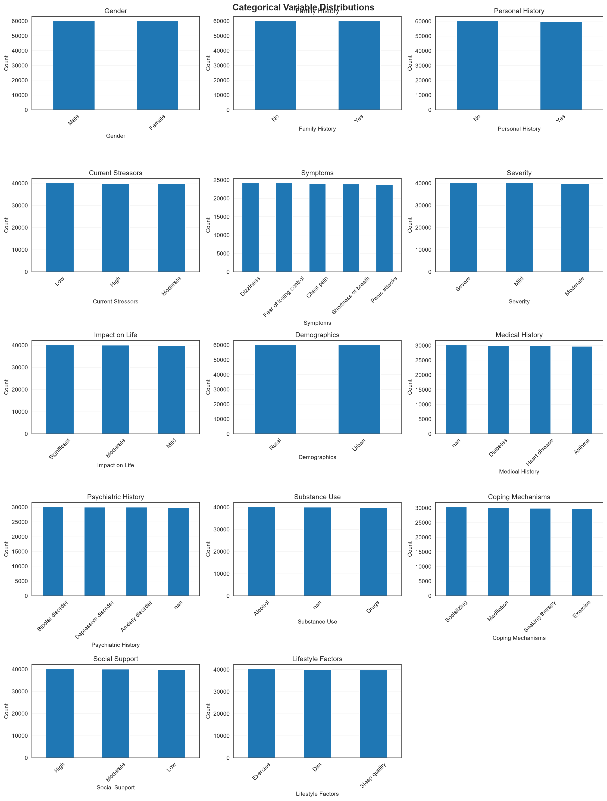
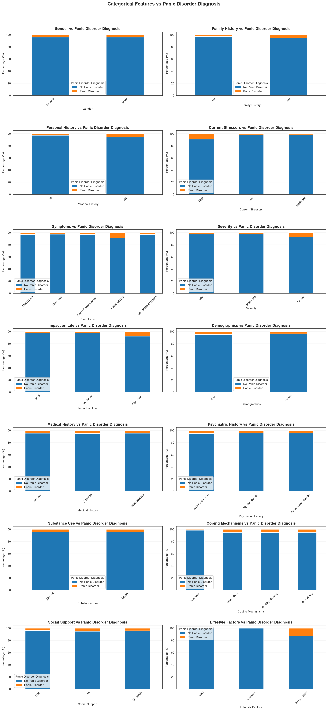

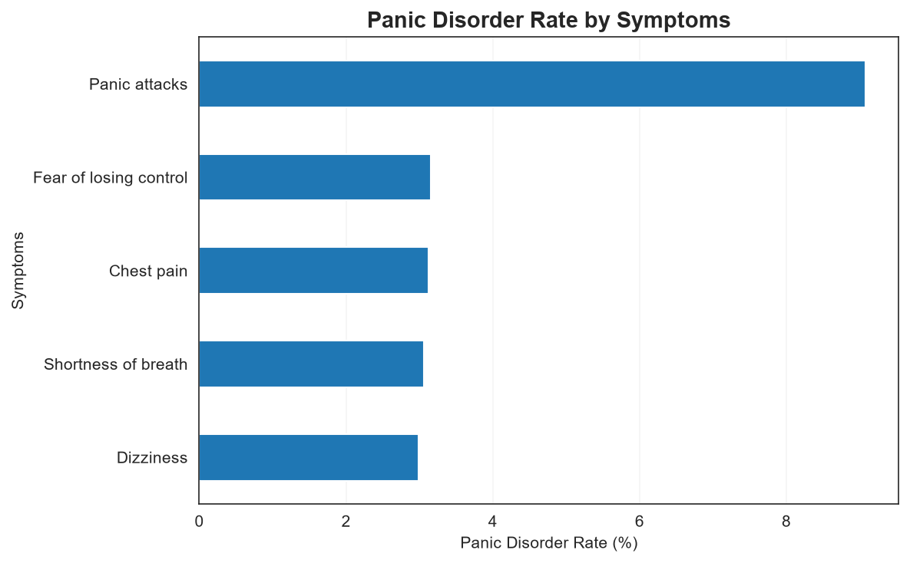


</details>

### What the EDA showed

1. **Severe class imbalance (4.27% positive).** Accuracy is uninformative, so PR-AUC, recall, precision and F1 are the primary metrics, and the split must be stratified.
2. **Age carries essentially no signal.** Mean age is 41.46 for negatives and 41.48 for positives, with identical quartiles.
3. **Category frequencies are almost perfectly uniform.** For example, `Severity` splits 40,068 / 39,843 / 40,089 and `Gender` 60,008 / 59,992, and each `Symptoms` level has about 24k records. Real clinical cohorts are rarely balanced on every axis.
4. **Missingness is informative.** Rows with a missing `Medical History` have a positive rate of 2.4%, against 4.8–5.0% when it is recorded. The same holds for `Psychiatric History` (3.1% vs 4.5–4.9%) and `Substance Use` (3.5% vs 4.6–4.7%). This matters for preprocessing (see [SHAP](#shap-explainability) and [Limitations](#limitations)).
5. **One variable stood out immediately.** Every positive case has `Lifestyle Factors = Sleep quality`. This triggered the formal audit below.

---

## Data leakage and synthetic-rule audit

In healthcare ML, a variable that perfectly separates the classes is usually **not** a discovery. It is more likely a proxy for the label, a post-diagnosis measurement, or a rule baked into a synthetic generator. A model trained on such data will look excellent internally and fail on real patients. For that reason the dataset was audited **before** the results were interpreted.

Implemented in [`src/analysis/leakage_audit.py`](src/analysis/leakage_audit.py) (`LeakageAudit.run_audit`):

- **Investigation 1:** the target rate within every category of every categorical predictor, flagging categories whose positive rate is exactly 0% or 100%.
- **Investigation 2:** χ² tests with bias-corrected Cramér's V, and point-biserial correlation for Age (see [Statistical analysis](#statistical-analysis)).

### Finding 1: a deterministic exclusion rule on `Lifestyle Factors`

| Lifestyle Factors | n | Positives | Positive rate |
|---|---:|---:|---:|
| Diet | 39,903 | **0** | **0.00%** |
| Exercise | 40,255 | **0** | **0.00%** |
| Sleep quality | 39,842 | 5,126 | 12.87% |

The audit flagged only these two categories as deterministic. `Lifestyle Factors ≠ Sleep quality` implies a negative label with certainty, across 80,158 records. Sleep quality is a necessary condition for a positive label in this dataset.

### Finding 2: graded, threshold-like risk inside the Sleep-quality subgroup

Within the Sleep-quality subgroup (n = 39,842), the other strong predictors behave like binary risk indicators. Each has one "risk" level, and the remaining levels behave identically: `Current Stressors` High is 27.7% positive vs 5.4% / 5.3% for Low and Moderate, and `Severity` Severe is 22.7% vs 8.0% / 8.0%. Counting seven such indicators gives a step-like pattern (an additional analysis for this README; [`docs/make_readme_figures.py`](docs/make_readme_figures.py)):

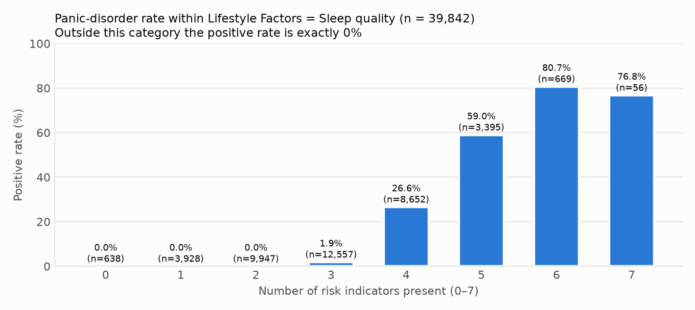

*Indicators: Current Stressors = High, Severity = Severe, Impact on Life = Significant, Symptoms = Panic attacks, Personal History = Yes, Family History = Yes, Coping Mechanisms ≠ Exercise.*

No record with 2 or fewer indicators is positive (n = 14,513). The rate then rises from 1.9% at 3 indicators to 26.6% at 4 and 59.0% at 5.

### Finding 3: predictors are mutually independent

The largest Cramér's V between any two predictors is **0.0086** (mean 0.0043). In a real population, variables such as `Severity`, `Impact on Life` and `Symptoms` would be expected to correlate.

### Interpretation

Taken together, these findings suggest the dataset was **probably generated synthetically**:

- near-uniform marginal distributions,
- mutually independent predictors,
- a hard exclusion on one category,
- a threshold-like dependence on a count of risk indicators.

In such a generator, the label is a (possibly noisy) rule over a few features. An additive logistic model fitted only inside the Sleep-quality gate reaches an AP of about 0.70, while shallow decision trees on the full data reach 0.84 (depth 6) and 0.99 (depth 8) in-sample. So the rule involves **interactions**, not a simple additive score. The exact generating rule is not known, and this README does not claim it.

> **Strong predictive association ≠ clinical causality.** That sleep quality is a necessary condition *in this dataset* says nothing about sleep and panic disorder in people. The audit shows that the dataset encodes a near-deterministic structure, which a model can learn perfectly without learning anything clinically transferable.

**Decision taken:** no features were removed. Both experiments measure what models achieve on the dataset as provided, and SHAP is then used to check whether they rely on the audited variables. A sensitivity analysis that excludes `Lifestyle Factors` is listed as [future work](#future-work).

---

## Statistical analysis

Implemented in [`src/analysis/statistical_tests.py`](src/analysis/statistical_tests.py) and run on the full 120,000-row dataset (exploratory, before splitting).

**Categorical predictors.** For each predictor, a χ² test of independence is run on the predictor × diagnosis contingency table, with missing values kept as their own `"Missing"` level. Effect size is the bias-corrected Cramér's V (Bergsma, 2013):

$$\tilde V = \sqrt{\frac{\tilde\varphi^2}{\min(\tilde k-1,\ \tilde r-1)}},\qquad \tilde\varphi^2=\max\!\Big(0,\ \tfrac{\chi^2}{n}-\tfrac{(k-1)(r-1)}{n-1}\Big)$$

**Numerical predictor (Age).** Point-biserial correlation with the binary target.

| Feature | χ² | df | p | Cramér's V |
|---|---:|---:|---:|---:|
| **Lifestyle Factors** | 10,773.2 | 2 | < 1e-300 | **0.2996** |
| **Current Stressors** | 3,665.4 | 2 | < 1e-300 | **0.1747** |
| **Impact on Life** | 1,949.6 | 2 | < 1e-300 | **0.1274** |
| **Symptoms** | 1,674.1 | 4 | < 1e-300 | **0.1180** |
| **Severity** | 1,504.5 | 2 | < 1e-300 | **0.1119** |
| Personal History | 666.6 | 1 | 5.4e-147 | 0.0745 |
| Coping Mechanisms | 629.9 | 3 | 3.3e-136 | 0.0723 |
| Family History | 538.2 | 1 | 4.7e-119 | 0.0669 |
| Medical History (incl. Missing) | 345.7 | 3 | 1.3e-74 | 0.0534 |
| Psychiatric History (incl. Missing) | 142.6 | 3 | 1.0e-30 | 0.0341 |
| Demographics | 124.8 | 1 | 5.7e-29 | 0.0321 |
| Social Support | 97.0 | 2 | 8.7e-22 | 0.0281 |
| Substance Use (incl. Missing) | 88.0 | 2 | 7.9e-20 | 0.0268 |
| Gender | 0.03 | 1 | 0.860 | 0.0000 |

| Feature | Point-biserial r | p | n |
|---|---:|---:|---:|
| Age | 0.0002 | 0.937 | 120,000 |

> The notebook's closing summary quotes values computed on the 100k training file alone (V = 0.3010 for Lifestyle Factors; r = −0.0005, p = 0.874 for Age). The table above uses the 120k merged dataset that the models are trained on. The conclusions are the same.

### Interpretation

- With n = 120,000, **almost any non-zero association is "significant"**. The p-values mostly reflect sample size; effect sizes are the informative quantity.
- By common rules of thumb for Cramér's V (about 0.1 small, 0.3 medium), only **Lifestyle Factors** reaches a medium association. Current Stressors, Impact on Life, Symptoms and Severity are small-to-moderate; everything else is weak.
- V ≈ 0.30 still **understates** how predictive Lifestyle Factors is. V summarizes the whole table and does not capture that two of three categories have **zero** positives. Marginal statistics also miss **interactions** (Finding 2), which is why tree ensembles far exceed what the individual V values suggest.
- **Gender and Age are unrelated to the label.** This is plausible for a synthetic generator that did not use them, and it contrasts with real-world epidemiology, where panic disorder is more prevalent in women.

---

## Data splitting

Implemented in [`src/pipelines/data_pipeline.py`](src/pipelines/data_pipeline.py). **The split happens before anything is fitted.**

| Split | Rows | Positives | Positive rate |
|---|---:|---:|---:|
| Train | 84,000 (70%) | 3,588 | 4.271% |
| Validation | 18,000 (15%) | 769 | 4.272% |
| Test | 18,000 (15%) | 769 | 4.272% |

- Two-stage `train_test_split`. First 15% is held out as test, then 15/85 of the remainder becomes validation. Both stages are **stratified** on the target with `random_state = 42`.
- **Training data** is used for imputation, encoding, SMOTENC (Exp. 2), Optuna and cross-validation.
- **Validation data** is used only to choose the best model per experiment (highest validation PR-AUC). XGBoost and LightGBM also receive it as an `eval_set` during final fitting, for monitoring only; **no early stopping is used**, so it does not affect the fitted model.
- **Test data** is used once, for final metrics, confusion matrices, calibration curves and the SHAP explanation sample. It plays no part in model, hyperparameter or experiment selection.

Keeping the test set out of all selection decisions is what makes its metrics an unbiased estimate of performance on new data **from the same distribution**.

> **Caveat.** The original 100k/20k file division is not preserved. The files are merged and re-split at random. Both files appear to come from the same generator (4.29% vs 4.21% positives).

---

## Data preprocessing

Implemented in [`src/data/data_preprocessing.py`](src/data/data_preprocessing.py) (`DataPreprocessor`) and saved to `artifacts/preprocessing/preprocessor.pkl`.

| Step | Detail |
|---|---|
| Identifier removal | `Participant ID` and the target are dropped from `X` before splitting |
| Numerical imputation | `SimpleImputer(strategy="median")`. This is a no-op here because Age is complete. |
| Categorical imputation | Per-column **mode** computed on the training split only, then applied to validation and test |
| Fitted modes (train) | `Medical History → Diabetes`, `Psychiatric History → Bipolar disorder`, `Substance Use → Alcohol` |
| Rows removed | 0 |

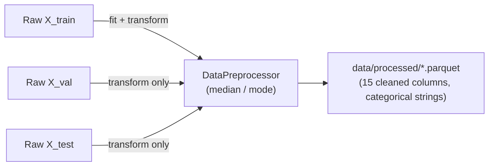

Imputation statistics come from the training split only, so validation and test rows never influence them. Note that mode imputation merges the informative "missing" state into a real category; the consequence shows up in [SHAP](#shap-explainability).

---

## Feature engineering

Implemented in [`src/features/build_features.py`](src/features/build_features.py) (`FeatureEngineer`) and orchestrated by `prepare_features()` in [`src/models/evaluate_model.py`](src/models/evaluate_model.py).

| Aspect | Implementation |
|---|---|
| Encoding | `OneHotEncoder(drop="first", handle_unknown="ignore", dtype=int)` on the 14 categorical columns |
| Unknown categories | Encoded as all-zeros (the reference level) |
| Output | **27 features**: `Age` plus 26 dummies. Identical in both experiments ([`feature_names.json`](artifacts/experiment_1/feature_engineering/feature_names.json)). |
| Scaling | **Model-specific.** Only Logistic Regression scales, through `Pipeline([StandardScaler, LogisticRegression])`, so the scaler is refit inside every CV fold. Tree models use unscaled inputs. |
| When fitted | **Inside each CV fold** on the fold's training portion, and on the full training split for final models. In Exp. 2, it is fitted **after** SMOTENC, on the resampled data. |
| Engineered features | None beyond encoding (no interactions, binning or ordinal mappings) |
| `encode_ordinal()` | Present in `FeatureEngineer` but **not used** by the current pipeline (SMOTENC works directly on the string-typed categories) |

Because of `drop="first"`, the reference levels are: Gender = Female, Family/Personal History = No, **Current Stressors = High**, Symptoms = Chest pain, Severity = Mild, Impact on Life = Mild, Demographics = Rural, Medical History = Asthma, Psychiatric History = Anxiety disorder, Substance Use = Alcohol, Coping Mechanisms = Exercise, Social Support = High, Lifestyle Factors = Diet. When reading SHAP, `Current Stressors_Low` therefore means "Low **instead of High**".

---

## Experimental design

Both experiments share the same split, the same preprocessing, the same four model families, the same Optuna search spaces, the same CV protocol and the same evaluation code. **The only difference is whether SMOTENC is applied to training data.** A single flag in `config.yaml` selects the experiment and routes artifacts to `artifacts/experiment_1/` or `artifacts/experiment_2/`.

```text
                         panic_disorder_dataset.csv (120k)
                                       |
                    Stratified split 70/15/15 (seed 42)
                    Train-only imputation (DataPreprocessor)
                                       |
                 +---------------------+---------------------+
                 |                                           |
   Experiment 1 — Baseline                      Experiment 2 — SMOTENC
   Experiment.SMOTENC: False                    Experiment.SMOTENC: True
   One-hot encode                               SMOTENC (training folds only) → One-hot
                 |                                           |
                 +---------------------+---------------------+
                                       |
               LR (scaled pipeline) · Random Forest · XGBoost · LightGBM
                                       |
            Optuna: 50 trials, objective = mean 5-fold CV PR-AUC
                                       |
                  Final 5-fold stratified CV → refit on full train
                                       |
         Validation (select best per experiment) · Test (report, bootstrap CI)
                                       |
              Confusion matrices · calibration curves · SHAP (selected)
                                       |
                       Experiment 1 vs Experiment 2 comparison
```

### Experiment 1 — Baseline

| Setting | Value |
|---|---|
| Resampling | None. Models see the natural 4.27% prevalence. |
| Class weighting | Searched by Optuna for LR (`None` / `balanced`); not used for the tree models |
| Encoding | One-hot, fitted per fold / on train |
| Hyperparameters | Optuna, 50 trials per model (selected values below) |
| CV | 5-fold `StratifiedKFold(shuffle=True, random_state=42)` on the 84k training split |
| Selection criterion | Highest **validation** PR-AUC → **LightGBM** |
| Decision threshold | 0.5 (the `predict()` default) for all threshold-based metrics |

### Experiment 2 — SMOTENC

**Motivation.** With 4.27% positives, classifiers trained on raw prevalence can be biased towards the majority class at a 0.5 threshold. Oversampling the minority class shifts what the model learns about the class prior, and the hope is that it also helps the model learn minority-class structure.

**Why SMOTENC, not SMOTE?** SMOTE interpolates between feature vectors. Interpolating one-hot columns produces impossible values (for example "0.4 × Severe"). SMOTENC interpolates numerical features (here only Age) and assigns each categorical feature the most frequent category among the k nearest minority neighbours, so categorical values stay valid.

**Where it is applied, as written in the code** (`prepare_features(use_smotenc=True)`):

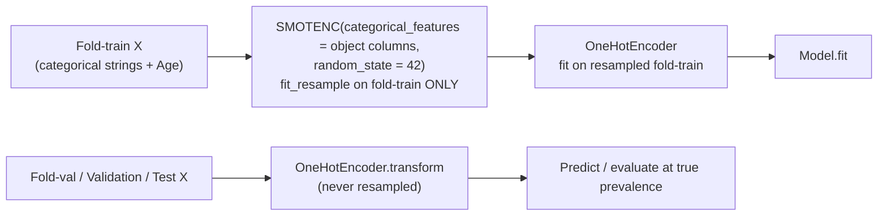

| Property | Value |
|---|---|
| Position | **After** the split, **inside every CV fold** (`_cross_validate_sklearn_model`, `run_optuna`) and once on the full training split for final models |
| Applied to | Training (fold) data only. Validation folds, the validation split and the test split keep their natural 4.27% prevalence. |
| Encoding order | SMOTENC on raw categorical strings → **then** one-hot encoding |
| `sampling_strategy` | Default (`"auto"`): minority upsampled to **1:1**. On the full training split, 3,588 real positives + 76,824 synthetic = 80,412 per class (160,824 rows). |
| `k_neighbors` | Default (5) |

Leakage is avoided because no synthetic record is ever derived from a validation or test record, and every metric is computed on real, non-resampled data.

---

## Cross-validation and hyperparameter optimization

### Cross-validation

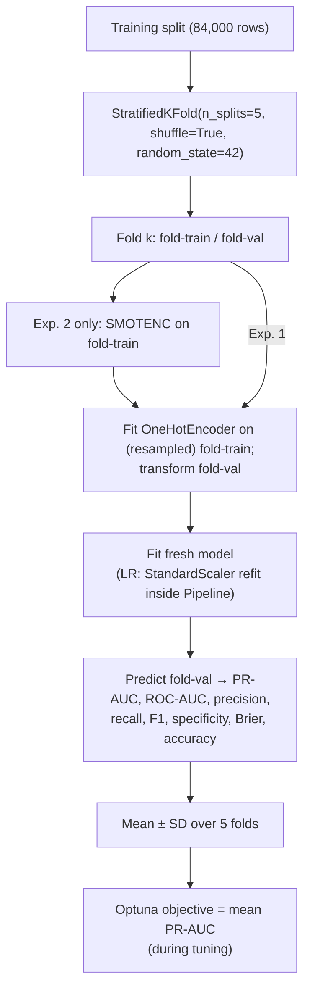

Encoders, the LR scaler and (in Exp. 2) SMOTENC are refit **within each fold**, so no fold-validation information reaches training. The same fold logic is used inside Optuna and in the final CV that is reported.

### Optuna

[`src/models/ML/optuna_tuner.py`](src/models/ML/optuna_tuner.py):

| Aspect | Implementation |
|---|---|
| Why | Default hyperparameters can hide real differences between model families. Tuning each model on the same objective makes the comparison fairer. |
| Sampler | `TPESampler(seed=42)` |
| Objective | **Mean 5-fold stratified CV PR-AUC** (`average_precision_score`), maximized |
| Per-fold processing | Same `prepare_features` as CV (encoders and SMOTENC fitted on fold-train) |
| Pruning | XGBoost / LightGBM only: `MedianPruner(n_startup_trials=5, n_warmup_steps=1)` on the running mean fold PR-AUC, plus Optuna's XGBoost/LightGBM pruning callbacks |
| Trials | 50 per model per experiment |
| Search spaces | `config.yaml → optuna.<model>`. LR: `C ∈ [1e-4, 100]` (log), `solver ∈ {lbfgs, liblinear}`, `class_weight ∈ {None, balanced}`. RF: `n_estimators`, `max_depth`, `min_samples_split/leaf`, `max_features ∈ {sqrt, log2, 1.0}`. XGB/LGBM: `n_estimators`, depth/leaves, `learning_rate` (log), subsampling, L1/L2 regularization (log). |

**Selected hyperparameters**

| Model | Experiment 1 (best CV PR-AUC) | Experiment 2 (best CV PR-AUC) |
|---|---|---|
| Logistic Regression | `C=43.4, solver=liblinear, class_weight=None` (0.6666) | `C=0.0011, solver=liblinear, class_weight=balanced` (0.6256) |
| Random Forest | `n_estimators=727, max_depth=15, min_samples_split=3, min_samples_leaf=6, max_features=1.0` (0.9497) | `n_estimators=929, max_depth=14, min_samples_split=17, min_samples_leaf=10, max_features=1.0` (0.9194) |
| XGBoost | `n_estimators=681, max_depth=8, lr=0.0106, subsample=0.988, colsample=0.933, min_child_weight=3, α=8.1e-4, λ=8.3e-4` (0.9642) | `n_estimators=443, max_depth=7, lr=0.0365, subsample=0.716, colsample=0.845, min_child_weight=2, α=2.9e-3, λ=6.8e-3` (0.9591) |
| LightGBM | `n_estimators=611, max_depth=8, num_leaves=18, lr=0.0617, subsample=0.668, colsample=0.626, min_child_samples=96, α=6.73, λ=1.10` (0.9672) | `n_estimators=730, max_depth=6, num_leaves=59, lr=0.0514, subsample=0.674, colsample=0.988, min_child_samples=79, α=4.98, λ=2.98` (0.9620) |

Observations:

- **Random Forest chose `max_features=1.0` in both experiments.** That means no feature subsampling, so the model is effectively bagged deep trees. On a label defined by interactions of a few features, randomly hiding those features from splits hurts. An earlier *untuned* run (`max_depth=10, max_features="sqrt"`, preserved in commit `7e19df9`) reached test recall of only 0.32 because its probabilities were compressed below 0.73. Tuning removed that problem.
- **In Exp. 2, Optuna chose `class_weight="balanced"` for LR on top of 1:1 SMOTENC.** That double re-weighting towards the minority class explains LR's recall of 1.000 and precision of 0.338 in Exp. 2.
- LightGBM's `subsample` has no effect while `subsample_freq` stays at its default of 0. The searched values were therefore inert, and row subsampling was not actually applied.

---

## Models

All four are created in [`src/models/ML/model_factory.py`](src/models/ML/model_factory.py).

| Model | Role in this study | Behaviour on this dataset |
|---|---|---|
| **Logistic Regression** (scaled pipeline) | Interpretable linear baseline | It is additive in log-odds, so it cannot represent the "Sleep quality **and** enough risk indicators" interaction found in the audit. It ranks well overall (ROC-AUC 0.98), but PR-AUC stays at 0.67 because it cannot separate positives from high-risk negatives within the gate. |
| **Random Forest** | Non-linear bagging baseline | Once tuned (all features per split, depth 15), it captures the interactions: PR-AUC 0.963, well calibrated. Its untuned configuration was strongly under-confident. |
| **XGBoost** | Gradient boosting | It fits the interaction structure directly and produces sharp, well-separated probabilities. Statistically tied with LightGBM. |
| **LightGBM** | Leaf-wise gradient boosting | Best point estimates on PR-AUC, recall, F1 and Brier in Exp. 1. Selected. |

---

## Evaluation metrics

Implemented in [`src/models/evaluate_model.py`](src/models/evaluate_model.py). All metrics are computed on validation folds, the validation split and the test split. Test metrics also get **bootstrap 95% CIs** (2,000 resamples, percentile method, seed 42).

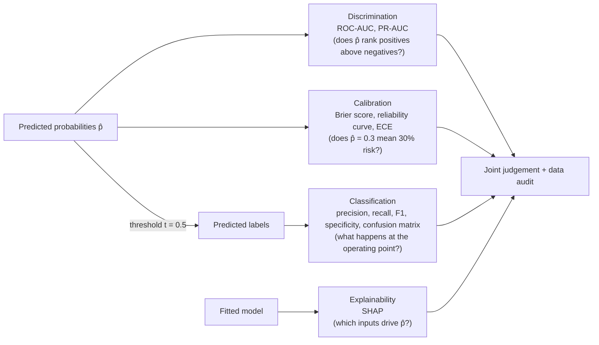

| Dimension | Question | Metrics |
|---|---|---|
| **Discrimination** | Can the model separate positive from negative cases? | ROC-AUC, **PR-AUC** (average precision) |
| **Classification** | How does the chosen threshold behave? | Precision, **recall** (sensitivity), F1, specificity, confusion matrix |
| **Calibration** | Are predicted probabilities numerically meaningful? | **Brier score**, reliability diagram, ECE (this README) |

The three dimensions are complementary. A model can rank perfectly yet be badly calibrated, and a well-ranked, well-calibrated model can still sit at an unhelpful threshold. Experiment 2 illustrates this: its ranking barely changes, its operating point moves a lot, and its calibration degrades.

### Why PR-AUC is the primary metric

ROC-AUC is the probability that a random positive is ranked above a random negative. Its false-positive-rate axis is normalized by the **114,874 negatives**, so even hundreds of false positives barely move it. In this dataset, 80,158 negatives (every Diet or Exercise record) are trivially separable, which inflates ROC-AUC for every model (0.98–0.999).

PR-AUC (average precision) is built from **precision and recall**. Both are about the minority class, and precision falls directly with every false positive. Its no-skill baseline is the prevalence (**0.043**), not 0.5. This is why models that look almost identical on ROC-AUC (0.983 vs 0.999) separate clearly on PR-AUC (0.67 vs 0.97). Recall measures the share of positives found, precision the share of flagged cases that are truly positive, and F1 their harmonic mean at the chosen threshold.

---

## Results

All values come from `artifacts/experiment_{1,2}/metrics/model_comparison.json`. The saved models were reloaded and the test set re-scored, which reproduced every stored metric exactly.

### Experiment 1 results

**Held-out test set (n = 18,000; 769 positives). Threshold 0.5. Brackets: bootstrap 95% CI.**

| Model | ROC-AUC | PR-AUC | Precision | Recall | F1 | Specificity | Brier |
|---|---:|---:|---:|---:|---:|---:|---:|
| Logistic Regression | 0.9828 | 0.6683 [0.634, 0.705] | 0.6636 | 0.4746 [0.440, 0.511] | 0.5534 | 0.9893 | 0.02163 |
| Random Forest | 0.9985 | 0.9632 [0.953, 0.972] | **0.8873** | 0.9012 [0.881, 0.921] | 0.8942 | **0.9949** | 0.00610 |
| XGBoost | 0.9986 | 0.9697 [0.963, 0.976] | 0.8801 | 0.8973 [0.874, 0.919] | 0.8886 | 0.9945 | 0.00594 |
| **LightGBM** (selected) | **0.9988** | **0.9721** [0.965, 0.979] | 0.8828 | **0.9207** [0.901, 0.939] | **0.9013** | 0.9945 | **0.00569** |

<details>
<summary>Experiment 1: 5-fold CV (mean ± SD) and validation split</summary>

| Model | CV PR-AUC | CV Recall | CV Precision | CV F1 | CV Brier | Val PR-AUC | Val Recall | Val F1 |
|---|---:|---:|---:|---:|---:|---:|---:|---:|
| Logistic Regression | 0.6666 ± 0.0116 | 0.4677 ± 0.0219 | 0.6519 ± 0.0086 | 0.5445 ± 0.0175 | 0.0218 ± 0.0004 | 0.6604 | 0.4655 | 0.5449 |
| Random Forest | 0.9497 ± 0.0062 | 0.9150 ± 0.0169 | 0.8555 ± 0.0093 | 0.8841 ± 0.0095 | 0.0068 ± 0.0004 | 0.9534 | 0.9025 | 0.8875 |
| XGBoost | 0.9642 ± 0.0059 | 0.9069 ± 0.0177 | 0.8670 ± 0.0039 | 0.8864 ± 0.0102 | 0.0064 ± 0.0005 | 0.9639 | 0.8947 | 0.8809 |
| LightGBM | 0.9672 ± 0.0047 | 0.9211 ± 0.0125 | 0.8627 ± 0.0071 | 0.8909 ± 0.0086 | 0.0063 ± 0.0004 | 0.9660 | 0.9168 | 0.8879 |

</details>

**Interpretation**

- **CV, validation and test agree.** For example, LightGBM PR-AUC is 0.967 in CV, 0.966 on validation and 0.972 on test, and fold SDs are small. The pipeline shows no overfitting or cross-split leakage **within this distribution**. That says nothing about other populations.
- **Tree ensembles dominate on PR-AUC (≈0.96–0.97 vs 0.67).** The audit showed the label depends on **interactions** (a gate on Sleep quality combined with a count of risk indicators), which trees represent directly and a linear-in-log-odds model cannot.
- **The three tree models are close.** LightGBM and XGBoost have overlapping CIs on every metric. Random Forest's PR-AUC interval ([0.953, 0.972]) overlaps both as well. The ranking LightGBM > XGBoost > RF is consistent across CV, validation and test, but the margins are small.
- **Logistic Regression misses about half the positives at 0.5.** Optuna chose `class_weight=None` because the objective is PR-AUC, which does not depend on the threshold. Its recall at 0.5 is therefore a threshold artefact layered on a real ranking limitation.

### Experiment 2 results

**Held-out test set. Threshold 0.5. Brackets: bootstrap 95% CI.**

| Model | ROC-AUC | PR-AUC | Precision | Recall | F1 | Specificity | Brier |
|---|---:|---:|---:|---:|---:|---:|---:|
| Logistic Regression | 0.9819 | 0.6157 [0.580, 0.654] | 0.3382 | **1.0000** [1.000, 1.000] | 0.5054 | 0.9127 | 0.06067 |
| Random Forest | 0.9977 | 0.9340 [0.916, 0.950] | 0.7797 | 0.9987 [0.996, 1.000] | 0.8757 | 0.9874 | 0.00929 |
| **XGBoost** (selected in Exp. 2) | 0.9985 | 0.9656 [0.957, 0.974] | **0.8277** | 0.9935 [0.987, 0.999] | **0.9031** | **0.9908** | 0.00756 |
| LightGBM | 0.9985 | **0.9668** [0.959, 0.974] | 0.8230 | 0.9974 [0.993, 1.000] | 0.9018 | 0.9904 | **0.00748** |

<details>
<summary>Experiment 2: 5-fold CV (mean ± SD) and validation split</summary>

| Model | CV PR-AUC | CV Recall | CV Precision | CV F1 | CV Brier | Val PR-AUC | Val Recall | Val F1 |
|---|---:|---:|---:|---:|---:|---:|---:|---:|
| Logistic Regression | 0.6256 ± 0.0134 | 1.0000 ± 0.0000 | 0.3283 ± 0.0048 | 0.4942 ± 0.0055 | 0.0621 ± 0.0010 | 0.6138 | 1.0000 | 0.5049 |
| Random Forest | 0.9194 ± 0.0073 | 0.9992 ± 0.0011 | 0.7585 ± 0.0091 | 0.8623 ± 0.0063 | 0.0107 ± 0.0004 | 0.9328 | 0.9987 | 0.8673 |
| XGBoost | 0.9591 ± 0.0039 | 0.9908 ± 0.0027 | 0.8044 ± 0.0084 | 0.8879 ± 0.0060 | 0.0085 ± 0.0003 | 0.9596 | 0.9896 | 0.8849 |
| LightGBM | 0.9619 ± 0.0046 | 0.9950 ± 0.0023 | 0.8029 ± 0.0088 | 0.8886 ± 0.0054 | 0.0085 ± 0.0004 | 0.9583 | 0.9883 | 0.8847 |

</details>

### Experiment 1 vs Experiment 2

**Combined test-set table**

| Model | Experiment | ROC-AUC | PR-AUC | Precision | Recall | F1 | Specificity | Brier |
|---|---|---:|---:|---:|---:|---:|---:|---:|
| Logistic Regression | 1 — Baseline | **0.9828** | **0.6683** | **0.6636** | 0.4746 | **0.5534** | **0.9893** | **0.02163** |
| Logistic Regression | 2 — SMOTENC | 0.9819 | 0.6157 | 0.3382 | **1.0000** | 0.5054 | 0.9127 | 0.06067 |
| Random Forest | 1 — Baseline | **0.9985** | **0.9632** | **0.8873** | 0.9012 | **0.8942** | **0.9949** | **0.00610** |
| Random Forest | 2 — SMOTENC | 0.9977 | 0.9340 | 0.7797 | **0.9987** | 0.8757 | 0.9874 | 0.00929 |
| XGBoost | 1 — Baseline | **0.9986** | **0.9697** | **0.8801** | 0.8973 | 0.8886 | **0.9945** | **0.00594** |
| XGBoost | 2 — SMOTENC | 0.9985 | 0.9656 | 0.8277 | **0.9935** | **0.9031** | 0.9908 | 0.00756 |
| LightGBM | 1 — Baseline | **0.9988** | **0.9721** | **0.8828** | 0.9207 | 0.9013 | **0.9945** | **0.00569** |
| LightGBM | 2 — SMOTENC | 0.9985 | 0.9668 | 0.8230 | **0.9974** | **0.9018** | 0.9904 | 0.00748 |

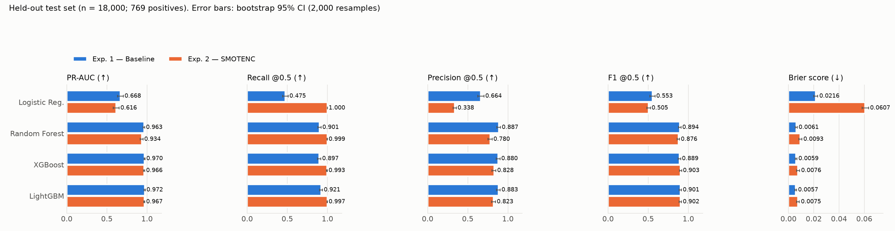

**Change from Exp. 1 to Exp. 2 (test)**

| Model | Δ PR-AUC | Δ Recall | Δ Precision | Δ F1 | Brier ratio | Δ FN | Δ FP |
|---|---:|---:|---:|---:|---:|---:|---:|
| Logistic Regression | −0.053 | +0.525 | −0.325 | −0.048 | ×2.80 | 404 → 0 | 185 → 1,505 |
| Random Forest | **−0.029** | +0.098 | −0.108 | −0.019 | ×1.52 | 76 → 1 | 88 → 217 |
| XGBoost | −0.004 | +0.096 | −0.052 | +0.015 | ×1.27 | 79 → 5 | 94 → 159 |
| LightGBM | −0.005 | +0.077 | −0.060 | +0.001 | ×1.31 | 61 → 2 | 94 → 165 |

#### 1. Which experiment performs better?

On the primary metric (PR-AUC), **Experiment 1 is better for all four models**. The direction holds in CV, validation and test alike. For Random Forest the decline is clearly beyond noise (test CIs [0.953, 0.972] vs [0.916, 0.950] do not overlap; CV 0.950 vs 0.919). For XGBoost and LightGBM the decline is small and within the CIs, but it is consistent in sign across all three evaluation sets. **SMOTENC never improved ranking.**

#### 2–3. Does SMOTENC improve recall? Does it reduce precision?

Yes to both, for every model. Recall at 0.5 rises to 0.99–1.00, and precision falls by 0.05–0.33. False negatives nearly disappear (LightGBM 61 → 2), while false positives grow 1.7–8× (LightGBM 94 → 165; LR 185 → 1,505).

#### 4. Does it improve PR-AUC?

No. PR-AUC fell for every model (−0.004 to −0.053).

#### 5. Does it change calibration?

Yes, for the worse. Brier scores rise 1.3–2.8×, and mean predicted risk on the test set rises from about 0.042 (≈ prevalence) to 0.050–0.149 (see [Calibration](#calibration-analysis)).

#### 6. What trade-offs does it introduce?

- **Operating point vs probability meaning.** Higher recall is bought with lower precision and inflated probabilities.
- **A synthetic-data artefact.** In Exp. 2, XGBoost places **51%** of its Age split thresholds at non-integer values (0% in Exp. 1), and LightGBM's share of splits on Age rises from 26% to 55%. Of the 76,824 synthetic positives, 89% have non-integer ages, a value no real record has, so the models partly learn to recognise *synthetic* rows. Age moves from SHAP rank 18 (Exp. 1) to rank 13 (XGBoost) and 10 (LightGBM) in Exp. 2, even though Age has no association with the label (r = 0.0002).
- **Cost.** The final training set grows from 84,000 to 160,824 rows (and each CV/Optuna fold grows similarly), which increases training cost.

#### 7–8. Which model is most robust, and is the effect consistent?

The direction is consistent: PR-AUC down, recall up, precision down, Brier up. **The size depends on the model.** Boosted models change least (Δ PR-AUC ≈ −0.005); RF and LR change most. Gradient boosting is the most robust family across both conditions.

#### Is the recall gain just a threshold shift?

To test this, each Exp. 1 model was given the threshold, **chosen on the validation set**, at which it reaches the Exp. 2 model's validation recall. Both were then scored on test:

| Model | Exp. 1 at validation-matched threshold (test) | Exp. 2 at 0.5 (test) |
|---|---|---|
| Logistic Regression (t = 0.019) | P 0.249 · R 1.000 · F1 0.398 | P 0.338 · R 1.000 · F1 0.505 |
| Random Forest (t = 0.237) | **P 0.813** · R 0.994 · **F1 0.894** | P 0.780 · R 0.999 · F1 0.876 |
| XGBoost (t = 0.255) | P 0.825 · R 0.990 · F1 0.900 | P 0.828 · R 0.994 · F1 0.903 |
| LightGBM (t = 0.287) | P 0.829 · R 0.988 · F1 0.902 | P 0.823 · R 0.997 · F1 0.902 |

For the three tree models, **a lower threshold on the baseline model reproduces the SMOTENC operating point with the same or better precision.** Random Forest is better without SMOTENC. XGBoost and LightGBM are equivalent within noise. So SMOTENC's apparent benefit is mainly an implicit threshold change. Logistic Regression is the exception: at recall 1.0, Exp. 2 LR is more precise. The comparison is confounded, though, because Exp. 2 LR also uses `class_weight="balanced"`, and its overall ranking (PR-AUC) is worse.

#### 9. Which experiment would I choose, and why?

**Experiment 1, with any desired recall/precision trade-off set by a threshold chosen on validation data.** It has:

- better or equal ranking (PR-AUC) for every model,
- well-calibrated probabilities that can be thresholded meaningfully,
- no synthetic-data artefacts,
- half the training cost.

If a high-sensitivity operating point is required, lowering the threshold of the Exp. 1 model achieves it as well as SMOTENC does, and with the probabilities still interpretable.

### Confusion matrix analysis (test set, threshold 0.5)

| Model | Exp. | TN | FP | FN | TP | Flagged | Positives missed |
|---|---|---:|---:|---:|---:|---:|---:|
| Logistic Regression | 1 | 17,046 | 185 | 404 | 365 | 550 | 52.5% |
| Logistic Regression | 2 | 15,726 | 1,505 | 0 | 769 | 2,274 | 0.0% |
| Random Forest | 1 | 17,143 | 88 | 76 | 693 | 781 | 9.9% |
| Random Forest | 2 | 17,014 | 217 | 1 | 768 | 985 | 0.1% |
| XGBoost | 1 | 17,137 | 94 | 79 | 690 | 784 | 10.3% |
| XGBoost | 2 | 17,072 | 159 | 5 | 764 | 923 | 0.7% |
| LightGBM | 1 | 17,137 | 94 | 61 | 708 | 802 | 7.9% |
| LightGBM | 2 | 17,066 | 165 | 2 | 767 | 932 | 0.3% |

| Exp. 1 LightGBM | Exp. 2 LightGBM |
|---|---|
| 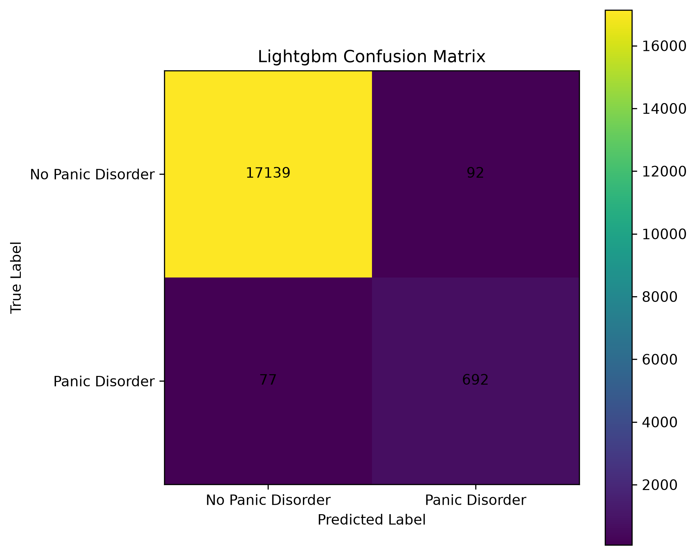 |  |

- **False negatives** are positive records labelled negative. In a screening scenario these would be missed cases, which is usually the costlier error.
- **False positives** are records flagged without a positive label. In screening they would mean additional follow-up assessment.
- Which balance is appropriate depends on prevalence, follow-up cost and the harm of a missed case in a real setting. **This dataset cannot provide those quantities**, so these results describe model behaviour on the dataset only, not clinical consequences.

---

## Calibration analysis

Reliability curves are produced by `calibration_curve_plot()` for every model on the test set (`sklearn.calibration.calibration_curve`, 10 **quantile** bins) and saved in `artifacts/experiment_*/metrics/calibration_curves/`. Over 90% of tree-model predictions fall below 0.01, so quantile bins crowd near zero and say little about the mid-range. For this README the curves were re-drawn with **10 equal-width bins** from the saved models. Models and predictions are unchanged; the script is [`docs/make_readme_figures.py`](docs/make_readme_figures.py).

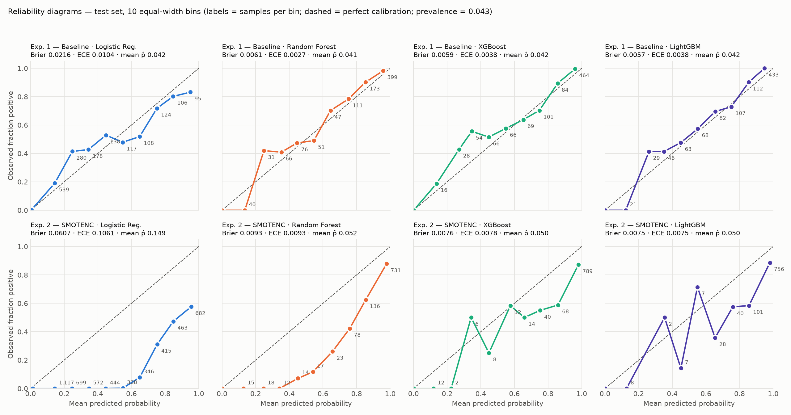

| Model | Exp. | Brier | Brier skill\* | ECE (10 bins) | Mean p̂ (prevalence 0.0427) |
|---|---|---:|---:|---:|---:|
| Logistic Regression | 1 | 0.02163 | 0.47 | 0.0104 | 0.042 |
| Logistic Regression | 2 | 0.06067 | **−0.48** | **0.1061** | **0.149** |
| Random Forest | 1 | 0.00610 | 0.85 | **0.0027** | 0.041 |
| Random Forest | 2 | 0.00929 | 0.77 | 0.0093 | 0.052 |
| XGBoost | 1 | 0.00594 | 0.85 | 0.0038 | 0.042 |
| XGBoost | 2 | 0.00756 | 0.82 | 0.0078 | 0.050 |
| LightGBM | 1 | **0.00569** | **0.86** | 0.0038 | 0.042 |
| LightGBM | 2 | 0.00748 | 0.82 | 0.0075 | 0.050 |

\* Brier skill = 1 − Brier / (π(1−π)) with π = 0.0427 (reference Brier 0.0409). Negative skill means the model does worse than always predicting the prevalence. ECE = bin-weighted mean |observed − predicted|.

### Interpretation

- **Experiment 1 models are calibrated "in the large".** Mean predicted risk matches prevalence to within 0.002. The tree models track the diagonal reasonably well. They are slightly under-confident in the 0.2–0.4 range: cases scored at about 0.25 are about 41% positive.
- **Experiment 2 models systematically over-predict risk.** They were trained at a 50% prevalence and are applied at 4.27%. The tree models' top bin (p̂ ≥ 0.9, 731–789 cases) is only 87–89% positive, against 98–100% in Exp. 1. For Exp. 2 Logistic Regression (SMOTENC plus balanced class weights), nothing below p̂ = 0.5 is positive, the 0.9+ bin is 58% positive, and its **Brier skill is negative**: as probability estimates, its outputs are worse than a constant prevalence forecast.
- **Discrimination ≠ calibration.** Exp. 2 LightGBM has almost the same ROC-AUC as Exp. 1 (0.9985 vs 0.9988), but its probabilities are numerically inflated. Any use of these scores as risk estimates, rather than as rankings, would require recalibration (for example Platt scaling or isotonic regression fitted on validation data) or prior correction for the resampling ratio.
- **Mid-range estimates are uncertain.** Each 0.1-wide bin between 0.1 and 0.9 holds at most about 175 test cases for the tree models (as few as 2 in Exp. 2), so conclusions about intermediate-risk calibration rest on few observations.

No recalibration has been applied yet. It is listed in [Future work](#future-work).

---

## SHAP explainability

Implemented in `run_shap_analysis()` ([`src/models/evaluate_model.py`](src/models/evaluate_model.py)):

- `shap.TreeExplainer` for tree models, and `shap.LinearExplainer` on the scaled inputs for LR.
- Explained sample: **2,000 random test records** (seed 42). Values are in **log-odds** units.
- The pipeline runs SHAP **only for the selected model**: Exp. 1 → LightGBM, Exp. 2 → XGBoost. To compare like with like, the table below also gives values for the non-selected boosted model in each experiment. These were **recomputed for this README** from the saved models with the identical protocol. The recomputed values match the pipeline's own CSVs for the selected models exactly.

> Saved SHAP outputs: `artifacts/experiment_1/metrics/shap/lightgbm_*` and `artifacts/experiment_2/metrics/shap/xgboost_*`. The Exp. 1 XGBoost and Exp. 2 LightGBM columns in the table below have no saved files; they were computed for this README only.

| Exp. 1 LightGBM (selected) — beeswarm | Exp. 2 XGBoost (selected) — beeswarm |
|---|---|
| 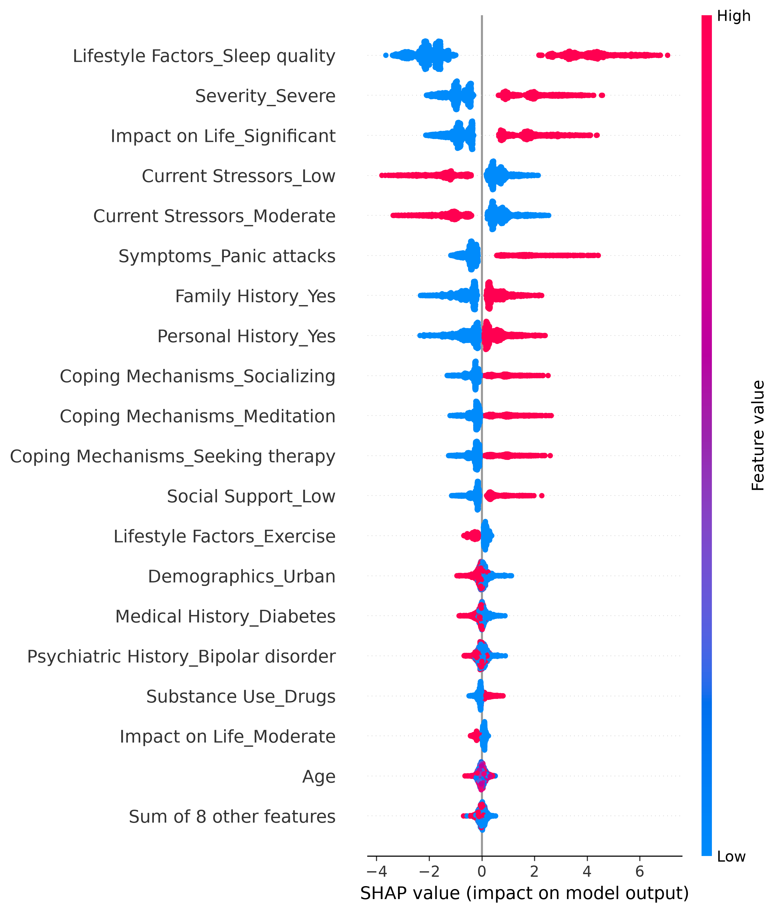 | 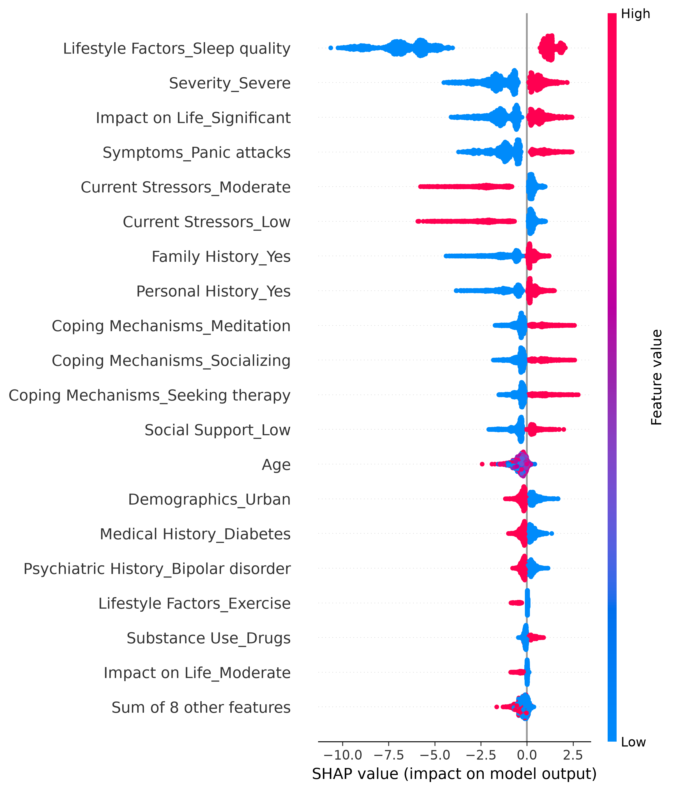 |

**Global importance: mean |SHAP| (log-odds); rank in brackets**

| Feature (one-hot; reference level in brackets) | Exp. 1 LightGBM | Exp. 1 XGBoost | Exp. 2 XGBoost | Exp. 2 LightGBM | Direction (beeswarm) |
|---|---:|---:|---:|---:|---|
| Lifestyle Factors_Sleep quality [Diet] | **2.164** (1) | **3.799** (1) | **4.880** (1) | **3.998** (1) | 1 → strongly ↑; 0 → ↓ |
| Impact on Life_Significant [Mild] | 1.130 (2) | 0.600 (4) | 1.186 (3) | 1.540 (3) | 1 → ↑ |
| Severity_Severe [Mild] | 1.074 (3) | 0.821 (2) | 1.304 (2) | 1.624 (2) | 1 → ↑ |
| Current Stressors_Moderate [High] | 1.041 (4) | 0.583 (5) | 1.046 (5) | 1.137 (6) | 1 → ↓ (i.e. not High) |
| Current Stressors_Low [High] | 0.972 (5) | 0.574 (6) | 1.012 (6) | 1.177 (5) | 1 → ↓ (i.e. not High) |
| Symptoms_Panic attacks [Chest pain] | 0.817 (6) | 0.716 (3) | 1.163 (4) | 1.194 (4) | 1 → ↑ |
| Family History_Yes [No] | 0.787 (7) | 0.411 (8) | 0.780 (7) | 0.816 (8) | 1 → ↑ |
| Personal History_Yes [No] | 0.757 (8) | 0.436 (7) | 0.733 (8) | 0.938 (7) | 1 → ↑ |
| Coping Mechanisms_{Socializing, Meditation, Seeking therapy} [Exercise] | 0.50–0.55 (9–11) | 0.26–0.29 (9–12) | 0.50–0.54 (9–11) | 0.49–0.68 | 1 → ↑ (i.e. not Exercise) |
| Social Support_Low [High] | 0.398 (12) | 0.268 | 0.497 (12) | 0.581 | 1 → ↑ |
| **Age** | 0.066 (18) | 0.050 (18) | **0.375 (13)** | **0.611 (10)** | Exp. 1: no pattern; Exp. 2: artefact (see below) |
| Medical History_Diabetes [Asthma] | 0.183 (15) | 0.200 (14) | 0.291 | 0.300 | 1 → ↓ (imputation artefact) |
| Gender_Male | 0.028 | — | 0.063 | — | negligible |

### What SHAP shows

1. **The model is built around one gate.** `Lifestyle Factors_Sleep quality` contributes about 2–4× more than any other feature in all four models. Its absence pushes log-odds down by about 1.5–2.5, which together with the low base rate drives predictions to near zero. Its presence adds about +2 to +5.
2. **Below the gate, the models use the seven audit "risk indicators".** The next eleven features are the same variables, at the same risk levels, that the audit identified: Severe, Significant, stressors High (appearing as negative SHAP for Low/Moderate, which are coded against High), Panic attacks, family/personal history Yes, and any coping mechanism other than Exercise.
3. **The explanation is stable** across both boosting libraries and both experiments. Only magnitudes change: Exp. 2 values are larger because the models' log-odds scale is shifted by the 1:1 training prior.
4. **SMOTENC artefact.** Age has essentially no SHAP contribution in Exp. 1 (rank 18), matching its null association. In Exp. 2 it rises to rank 10–13, and the split-threshold analysis shows the models splitting at fractional ages, which exist only in synthetic rows. This is a model-behaviour artefact of resampling, not a signal about age.
5. **Imputation artefact.** `Medical History_Diabetes = 1` *lowers* predicted risk, although raw Diabetes records have the *highest* positive rate among recorded medical histories (5.0%). The reason is that missing values (2.4% positive) were imputed with the training mode, Diabetes. After imputation, about half of the "Diabetes" rows are formerly missing, lower-risk rows (post-imputation rate 3.7%). The model has partly learned **"was missing"** under the label "Diabetes". `Psychiatric History_Bipolar disorder` (also the imputed mode) shows the same pattern.

> **SHAP describes model behaviour and feature contributions; it does not establish causal relationships.** A positive SHAP value for "Panic attacks" means the model raises its output when that value is present. It does not mean that the symptom causes, or is evidence of, panic disorder outside this dataset.

---

## Linking statistical analysis, leakage audit and SHAP

| Variable | Cramér's V (rank) | Audit finding | Exp. 1 LightGBM SHAP rank |
|---|---|---|---:|
| Lifestyle Factors | 0.300 (1) | **Deterministic:** Diet/Exercise → 0% positive | 1 (and 13 via Exercise) |
| Current Stressors | 0.175 (2) | High is a risk indicator (27.7% vs 5.4%) | 4–5 |
| Impact on Life | 0.127 (3) | Significant is a risk indicator | 2 |
| Symptoms | 0.118 (4) | Panic attacks is a risk indicator | 6 |
| Severity | 0.112 (5) | Severe is a risk indicator | 3 |
| Personal / Family History | 0.075 / 0.067 | Yes is a risk indicator | 7–8 |
| Coping Mechanisms | 0.072 | Not Exercise is a risk indicator | 9–11 |
| Age, Gender | ≈ 0 | no association | 18, 21 |

**The overlap is almost complete.** The variables flagged as suspicious by the audit, ranked highest by marginal association, and ranked highest by SHAP are the same set, in nearly the same order. This supports three conclusions:

1. **The models are faithful to the data.** They learned the structure the data contains and nothing else. There is no hidden leakage from IDs, ordering or preprocessing, apart from the two artefacts identified above (imputation, SMOTENC), which SHAP itself exposed.
2. **The performance is the structure.** A PR-AUC of 0.97 largely measures how well tree ensembles recover a near-deterministic labelling rule. It does **not** measure how well panic disorder can be detected from these characteristics in people.
3. **Plausible variables are not proof of validity.** Severity, panic attacks, stressors and family history are plausible clinical correlates, and that plausibility makes the result easy to over-read. But a hard 0% rate for two lifestyle categories has no clinical counterpart.

The defensible conclusion: **the pipeline is sound and the models fit this dataset extremely well, but the dataset's apparent synthetic structure prevents any claim about clinical predictive validity.**

---

## Model selection

| Criterion | Experiment 1 | Experiment 2 |
|---|---|---|
| Rule in code: highest validation PR-AUC | **LightGBM** (0.9660 vs XGB 0.9639, RF 0.9534) | **XGBoost** (0.9596 vs LGBM 0.9583) |
| Test PR-AUC of the selected model | 0.9721 [0.965, 0.979] | 0.9656 [0.957, 0.974] |
| Calibration (Brier) | 0.00569 | 0.00756 |

**Overall choice: Experiment 1 LightGBM.**

- It has the best test PR-AUC, recall, F1 and Brier score of all eight models.
- Its probabilities are calibrated at the true prevalence.
- It shows no resampling artefacts.

Comparing experiments on validation PR-AUC (0.9660 vs 0.9596) leads to the same choice without touching the test set. XGBoost (Exp. 1) is statistically indistinguishable and an equally defensible alternative.

---

## Project architecture

```text
Healthcare_research/
├── config.yaml                     # Single source of truth: paths, split, experiment flag, model + Optuna spaces
├── categorical_values.yaml         # Allowed category levels (generated by data_pipeline; used by Streamlit)
├── requirements.txt                # Dependency ranges
├── .python-version                 # 3.11.4 (local venv)
├── runtime.txt                     # python-3.12.8 (Streamlit Cloud runtime)
│
├── data/
│   ├── raw/                        # training.csv (100k), testing.csv (20k), merged panic_disorder_dataset.csv (120k)
│   └── processed/                  # X/y {train,val,test}.parquet: split + imputed, not yet encoded
│
├── src/
│   ├── data/
│   │   ├── data_ingestion.py       # DataIngestion: load CSV/parquet/xlsx, overview printout
│   │   └── data_preprocessing.py   # DataPreprocessor: train-fitted median/mode imputation, parquet export
│   ├── features/
│   │   └── build_features.py       # FeatureEngineer: OneHotEncoder (+ unused OrdinalEncoder helper)
│   ├── analysis/
│   │   ├── leakage_audit.py        # LeakageAudit: category target rates, deterministic categories
│   │   └── statistical_tests.py    # χ² + bias-corrected Cramér's V; point-biserial (Age)
│   ├── models/
│   │   ├── ML/model_factory.py     # create_model(): LR pipeline, RF, XGBoost, LightGBM
│   │   ├── ML/optuna_tuner.py      # run_optuna(): TPE + MedianPruner, CV PR-AUC objective
│   │   └── evaluate_model.py       # prepare_features (incl. SMOTENC), CV, metrics, bootstrap CI,
│   │                               #   confusion matrices, calibration curves, SHAP
│   ├── pipelines/
│   │   ├── data_pipeline.py        # ingest → split → impute → save parquet + preprocessor
│   │   └── ml_training_pipeline.py # Optuna → CV → refit → val/test eval → SHAP → save artifacts
│   ├── visualization/eda_plots.py  # EDAVisualizer
│   └── utils/                      # config loader, logger
│
├── artifacts/
│   ├── preprocessing/preprocessor.pkl
│   ├── experiment_1/               # Baseline
│   │   ├── feature_engineering/    # feature_engineer.pkl, feature_names.json (27 features)
│   │   ├── models/<model>/<model>_model.joblib
│   │   └── metrics/
│   │       ├── model_comparison.json          # val / test (+CI) / CV / Optuna params / best_model
│   │       ├── comparison/                    # model_comparison.csv, 15_model_comparison.png
│   │       ├── confusion_matrices/            # raw + row-normalized, per model
│   │       ├── calibration_curves/            # per model (quantile bins)
│   │       └── shap/                          # beeswarm, bar, CSV
│   └── experiment_2/               # SMOTENC — same layout
│
├── app/                            # FastAPI inference service
│   ├── main.py                     # entry point: /health, /info, /predict, /predict/batch
│   ├── main_monitor.py             # Prometheus variant (not functional yet)
│   └── loader.py, inference.py, schemas.py
│
├── streamlit/
│   ├── app.py                      # UI client for the API (API_URL env var, default localhost:8000)
│   └── appp.py                     # variant pointing at a hosted (Render) API URL
│
├── notebooks/
│   ├── 01_eda.ipynb                # EDA + leakage audit + statistical tests
│   ├── 02_preprocessing_&_feature_engineering.ipynb   # earlier interactive version of split/encode (outdated API)
│   ├── Study_1/01_eda.ipynb        # unrelated freight-pricing EDA (not part of this study)
│   └── reports/figures/            # EDA figures
│
└── docs/
    ├── make_readme_figures.py      # regenerates README figures from saved artifacts (read-only)
    └── figures/                    # audit gradient, Exp. 1 vs 2 metrics, reliability diagrams
```

Notes:

- `notebooks/02_preprocessing_&_feature_engineering.ipynb` shows outputs from an earlier `FeatureEngineer` API (`fit_transform` / `transform`) that no longer exists. The scripts in `src/pipelines/` are the authoritative pipeline.
- `config.yaml → paths.feature_names` points at `artifacts/feature_engineering/`. The training pipeline actually writes to `artifacts/experiment_*/feature_engineering/`.
- `config.yaml` defines `artifacts.experiment_*.validation_predictions`, but no predictions file is written yet.

---

## Installation

```bash
git clone <this-repo>
cd Healthcare_research

python -m venv .venv
# Windows
.venv\Scripts\activate
# macOS / Linux
source .venv/bin/activate

pip install -r requirements.txt
```

The reported runs used Python 3.11.4 with scikit-learn 1.9.1, imbalanced-learn 0.14.2, XGBoost 3.2.0, LightGBM 4.7.0, SHAP 0.51.0 and Optuna 4.9.0. `requirements.txt` specifies version ranges, not a lock file.

## Reproducibility

All randomness is seeded from `config.yaml → training.random_state = 42`: the split, CV folds, models, SMOTENC, the Optuna sampler, SHAP sampling and the bootstrap. Multi-threaded tree training may still introduce tiny run-to-run differences. Run every command from the repository root.

```bash
# 1. (Optional) merge the raw files — done in notebooks/01_eda.ipynb ("Load data" cell).
#    Output already committed: data/raw/panic_disorder_dataset.csv

# 2. Split + train-only imputation → data/processed/*.parquet, artifacts/preprocessing/preprocessor.pkl
python -m src.pipelines.data_pipeline

# 3a. Experiment 1 — set in config.yaml:  Experiment.SMOTENC: False,  optuna.enabled: True
python -m src.pipelines.ml_training_pipeline

# 3b. Experiment 2 — set in config.yaml:  Experiment.SMOTENC: True,   optuna.enabled: True
python -m src.pipelines.ml_training_pipeline

# 4. README figures (read-only; uses saved models and artifacts of both experiments)
python docs/make_readme_figures.py .
```

- Each training run performs 50 Optuna trials × 5 folds for each of the 4 models, and then a final CV. Experiment 2 is slower because every training fold is resampled to roughly twice its size.
- Setting `optuna.enabled: False` trains with the default hyperparameters in `config.yaml → training` instead.
- The EDA, audit and statistics are in `notebooks/01_eda.ipynb`.

## Usage

- **Inspect results:** `artifacts/experiment_*/metrics/model_comparison.json` (all metrics, CIs, CV, Optuna parameters) or `comparison/model_comparison.csv`.
- **Load a trained model and score new records** (Python):

```python
import joblib, pandas as pd

pre = joblib.load("artifacts/preprocessing/preprocessor.pkl")
fe  = joblib.load("artifacts/experiment_1/feature_engineering/feature_engineer.pkl")
mdl = joblib.load("artifacts/experiment_1/models/lightgbm/lightgbm_model.joblib")

X_raw = pd.read_parquet("data/processed/X_test.parquet")   # or a DataFrame with the 15 raw predictor columns
X = fe.encode_onehot(pre.transform(X_raw), fit=False)
risk = mdl.predict_proba(X)[:, 1]
```

---

## FastAPI deployment

**Status: working local service (verified end-to-end, October 2026).** It runs locally and is not a production deployment: it has no authentication, no input-category validation and no hosted instance.

### Run it

Start the API **from the repository root**, because loading the saved `FeatureEngineer` / `DataPreprocessor` objects imports the `src` package:

```bash
uvicorn app.main:app --reload --port 8000
# Interactive docs: http://localhost:8000/docs

streamlit run streamlit/app.py      # optional UI client; set API_URL if the API is not on localhost:8000
```

### Endpoints

| Endpoint | Method | Purpose |
|---|---|---|
| `/health` | GET | `{"status": "ok", "model_loaded": true}` once artifacts are loaded |
| `/info` | GET | Served model's test metrics (PR-AUC, ROC-AUC, precision, recall, F1, specificity, Brier) and its 27 feature names |
| `/predict` | POST | One record → `{prediction, probability, is_panic_disorder}` |
| `/predict/batch` | POST | `{"requests": [...]}` with 1–1,000 records → `{predictions, probabilities, panic_disorder_count, total}` (empty or >1,000 → HTTP 422) |

### What is served

`app/loader.py` loads the **Experiment 1** artifacts (`config.yaml → artifacts.experiment_1`) once at startup and caches them:

| Artifact | Path |
|---|---|
| Model | the `best_model` named in `artifacts/experiment_1/metrics/model_comparison.json` → currently **LightGBM** (`models/lightgbm/lightgbm_model.joblib`) |
| Imputer | `artifacts/preprocessing/preprocessor.pkl` (train-fitted `DataPreprocessor`) |
| Encoder | `artifacts/experiment_1/feature_engineering/feature_engineer.pkl` (train-fitted `FeatureEngineer`) |
| Feature order | `artifacts/experiment_1/feature_engineering/feature_names.json` |

Inference path (`app/inference.py`), the same transformations as training:

1. Rename snake_case API fields to dataset column names.
2. `DataPreprocessor.transform` (train-fitted imputation).
3. `FeatureEngineer.encode_onehot(..., fit=False)` (train-fitted one-hot encoder).
4. Align columns to `feature_names.json`.
5. `model.predict_proba` → `probability`; `model.predict` → `prediction` (threshold **0.5**).

### Example

Request (`POST /predict`):

```json
{
  "age": 34, "gender": "Female", "family_history": "Yes", "personal_history": "No",
  "current_stressors": "Low", "symptoms": "Chest pain", "severity": "Moderate",
  "impact_on_life": "Moderate", "demographics": "Urban", "medical_history": "Asthma",
  "psychiatric_history": "Bipolar disorder", "substance_use": "Drugs",
  "coping_mechanisms": "Exercise", "social_support": "Low", "lifestyle_factors": "Diet"
}
```

Response:

```json
{"prediction": 0, "probability": 2e-06, "is_panic_disorder": false}
```

The same record with `lifestyle_factors: "Sleep quality"`, `current_stressors: "High"`, `severity: "Severe"`, `impact_on_life: "Significant"`, `symptoms: "Panic attacks"`, `personal_history: "Yes"` and `coping_mechanisms: "Meditation"` returns `{"prediction": 1, "probability": 0.94686, "is_panic_disorder": true}`. This reflects the gate-plus-risk-indicator structure described in the [audit](#data-leakage-and-synthetic-rule-audit).

### Verification

The running server was tested with HTTP requests:

- `/health` and `/info` return 200; `/info` reports the Exp. 1 LightGBM test metrics shown in [Results](#experiment-1-results).
- **Training/serving parity:** 500 test-set records were sent through `/predict/batch`. The returned probabilities match the saved model applied directly to the same records to within 5 × 10⁻⁷, which is the API's 6-decimal rounding.
- Batch-size limits work: an empty batch and a batch of 1,001 records are both rejected with 422.

### Remaining limitations

1. **Missing history values cannot be sent.** `medical_history`, `psychiatric_history` and `substance_use` are required strings in `app/schemas.py`, so `null` is rejected with 422, although 25–33% of the data has these fields missing. Making them `str | None = None` would let the train-fitted imputer handle them.
2. **No category validation.** An unseen value (for example `"symptoms": "Headache"`) is accepted and silently encoded as the reference level, because the encoder uses `handle_unknown="ignore"`. Restricting fields to the values in `categorical_values.yaml` (for example with `Literal[...]` types) would reject such inputs.
3. **The served experiment is fixed in code** (`experiment_1` in `app/loader.py`), and the decision threshold is fixed at 0.5.
4. **`app/main_monitor.py` (Prometheus variant) is not functional.** It needs `prometheus_client` (not in `requirements.txt`), uses `body.transactions` where the schema defines `requests`, and reads `arts["model_version"]`, which the loader does not return. `app/main.py` is the working entry point.
5. **Local prototype only.** There is no authentication or rate limiting, and CORS allows all origins. The Streamlit client was not part of this verification.

---

## Limitations

1. **Dataset provenance is undocumented.** There is no record of who produced the data, how participants were recruited, or how the diagnosis was established.
2. **The dataset appears synthetic.** The evidence: near-uniform marginals, independent predictors (max inter-predictor V = 0.009), a deterministic exclusion (Diet/Exercise → 0% positive) and a threshold-like risk-indicator gradient. Performance on such data measures **rule recovery**, not clinical detection.
3. **High performance largely reflects dataset structure.** PR-AUC ≈ 0.97 should not be quoted as an estimate of real-world screening accuracy.
4. **No external validation.** Train, validation and test come from the same merged distribution, and the original 100k/20k division is not preserved.
5. **No prospective or clinical validation, and no deployment.** The models have never been evaluated on real patients or in a clinical workflow.
6. **Dataset shift.** Real populations would differ in prevalence, missingness and correlations between variables. Calibration in particular would not transfer.
7. **Imputation discards information.** Missingness predicts the label (2.4% vs about 5% positive), but mode imputation folds it into a real category, which produces the misleading "Diabetes lowers risk" SHAP pattern.
8. **SMOTENC artefacts.** The 1:1 oversampling creates non-integer ages that the models exploit. The default `sampling_strategy` and `k_neighbors` were not varied.
9. **Ordinal variables are treated as nominal.** Ordering information (Mild < Moderate < Severe) is not used.
10. **The 0.5 threshold is arbitrary** for imbalanced data. Recall, precision and F1 depend strongly on it, as the threshold-shift analysis shows.
11. **Mid-range calibration is uncertain.** Few test cases fall between 0.1 and 0.9 predicted probability.
12. **Exploratory analysis used the full dataset.** EDA and the audit included rows that later became the test set. No feature selection was based on them, but the analysis was not blind to test-set statistics.
13. **SHAP is not causal.** It reflects how the model uses correlations within this dataset. With one-hot encoding, importance is split across dummies defined relative to arbitrary reference levels.
14. **Some post-hoc analyses are diagnostic only.** The threshold-shift comparison, ECE, split-threshold analysis and non-selected-model SHAP values were computed for this README from the saved models. They are not produced by the training pipeline and did not influence any model selection.

---

## Ethical / clinical disclaimer

This project is an **experimental research and portfolio project**. It is **not a clinically validated diagnostic tool**. It has not been evaluated on real patients or reviewed by clinicians or regulators. Its outputs **must not be used for medical diagnosis, screening or treatment decisions**. Anyone concerned about panic attacks or anxiety should consult a qualified healthcare professional.

---

## Future work

Already completed and therefore not listed here: both experiments with Optuna tuning, calibration curves, SHAP for the selected models, and a working, verified FastAPI service (see [Implementation status](#implementation-status)).

**Deployment / API**

- [ ] Add automated API tests (health, info, single/batch prediction, training–serving parity, input validation).
- [ ] Re-test the Streamlit client against the working API.
- [ ] Docker image, CI pipeline, and a hosted API and Streamlit front-end with authentication.

**Pipeline engineering**

- [ ] Persist validation/test predictions (`validation_predictions` is configured but not written).
- [ ] Run SHAP for every model, not only the selected one, and clear the SHAP folder at the start of each run so that files from earlier runs cannot persist.

**Methodology**

- [ ] **Leakage sensitivity analysis:** retrain without `Lifestyle Factors`, and separately within the Sleep-quality subgroup only, to quantify how much performance depends on the gate.
- [ ] Explicit "Missing" categories or missingness indicators instead of mode imputation.
- [ ] Ordinal encoding for Severity, Impact on Life, Current Stressors and Social Support.
- [ ] **Probability recalibration** (Platt / isotonic on validation); report ECE and calibration slope/intercept in the pipeline.
- [ ] **Threshold selection on validation** (fixed sensitivity or cost-weighted), reported on test.
- [ ] **Decision-curve analysis** (net benefit across threshold probabilities).
- [ ] Paired bootstrap tests for model-vs-model and experiment-vs-experiment differences.
- [ ] Subgroup and fairness analysis (gender, demographics, age bands).
- [ ] Uncertainty estimation (for example, conformal prediction).
- [ ] Formal synthetic-rule extraction (shallow trees or RuleFit) to characterize the generator.
- [ ] Deep tabular models (**MLP, TabNet, FT-Transformer**).

## Author

**Loubna-ai** — healthcare ML research portfolio project.

If you use or build on this work, please cite the original dataset source (to be added) and note the limitations above.
